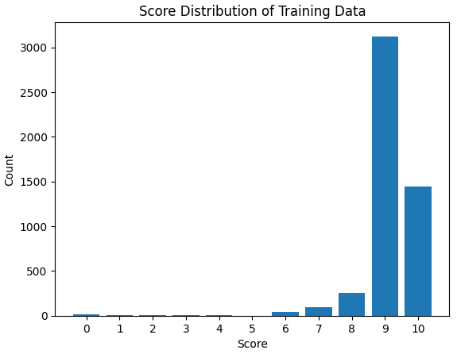
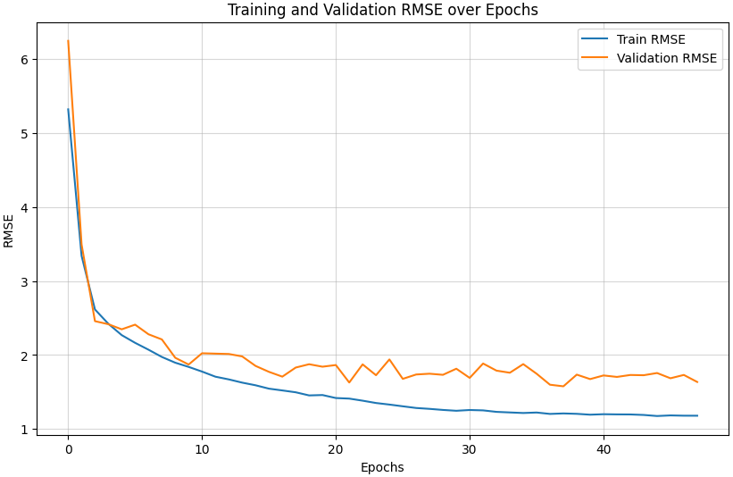

# 📘 Endsem – Kaggle Data Challenge

## Name: Krishna Chaitanya
## Roll No: DA25M011

## 📂 Submission Contents
submission.ipynb → The single notebook that contains all code, visualisations, and explanations for this assignment.

plots → Images of plots depicted in the Readme(Class imbalance and val loss)

## 📌 Overview

We are in the era of **Large Language Models** where these are
increasingly in various domains such as education,healthcare etc. So we
need a **reliable model** to handle these tasks and the usage of LLM
increasing day by day evaluation of their responses has become critical
to build more reliable model. **Traditional Human** evaluation although
accurate its slow and subjective. So we cannot scale this evaluation to
**massive number** of interactions these LLMs generate.

In this **Data Challenge** we are going to tackle this problem by
building a **robust metric learning model** to predict the **fitness**
or similarity score between a specific AI Evaluation Metric Definition
and a corresponding Prompt-Response Text Pair.

So goal of our this challenge is Given a metric definition (text
embedding) and a prompt-response pair (text), predict the relevance or
fitness on a scale of 1-10.

## Exploratory Data Analysis

### Data Structure

The data was provided in **JSON** format, which consists of both
training and testing sets:

1.  **Training Data:** Contains records with the *Metric Name*, *User
    Prompt*, *System Prompt*, *Response*, and a ground-truth *Score*
    (ranging from $0.0$ to $10.0$) and prompt and responses are
    multilingual.

2.  **Test Data:** Contains same fields as training data but omits the
    score which is target value for prediction

### Class Imbalance

TO proceed further we need to check if there is any **skewed**
distribution.Because if distribution is skewed model instead of
**generalizing** it memorizes the highly repeated value to obtain low
**training loss** but may not perform well on test data.Here is the
**Bar plot** depicting the **class imbalance** in target variable
(*score*) training data.

We can see data is highly skewed to scores 9's and 10's we need a way to
fix that otherwise model may only predict 9 and 10.

### Handling Null Values

Before diving into fixing class imbalance we need to check couple of
more things that is checking any null or outliers values exist in data.\
While checking imbalance I observed there is score of 9.5 as we need to
predict the **discrete values** between 0 and 10 . I have dropped the
row and also there is one row with response as null I have dropped it
because we need user response to train the model.

## Embedding Generation

To generate the embeddings for *prompt* and *response* in both train and
test data I used **l3cube-pune/indic-sentence-bert-nli**.The main reason
to chose this model for generation because as mentioned in data
structure the prompts and responses are multi lingual and constructed
using Tamil, Hindi, Assamese, Bengali, Bodo, Sindhi, and English
languages. Therefore I need a model that was trained on **Indian
Languages** and computationally efficiently

## Data Generation

As we saw in the *EDA* the training data is highly skewed towards 9 an
10 leaving with very few samples for scores $0-8$.Here are various ideas
i implemented to tackle imbalance.And before data generation the data is
s**splitted** into **training and validation** sets using
**train-test-split** so that we evaluate the model on original data only
and synthetic samples were generated only on training data.

### Attempt -1 : SMOTE Over Sampling

As **SMOTE** is famous *oversampling* i tried to over sample the
minority classes using SMOTE but this failed to produce viable training
data and its because

-   **High Data Dimension :** SMOTE over samples using interpolation
    techniques to its nearest neighbors but in high dimensional data the
    nearest neighbor nearest becomes less reliable due to the **curse of
    dimensionality** And our data being high dimensional embeddings
    SMOTE failed to generate new samples.

-   **Extreme Class Sparsity :** SMOTE is to generate minority class
    samples but if the initial minority class samples are small size it
    is not enough information for smote to generate and we can see in
    figure [1](#fig:initial_data1) minority samples combined are less
    than 500 (not even 10 % of training data) which makes it difficult
    for SMOTE to generate samples per bin.

### Attempt - 2 : Gaussian Mixture Models

Next I Tried more robust algorithm than SMOTE which is **Gaussian
Mixture Models** but this algorithm also failed to produce viable
training data and its because

-   **High Data Dimension :** GMM fails to generate high dimensional
    data because the problem becomes more difficult to model effectively
    and our data being high dimensional embeddings GMM failed to
    generate new samples.

### Attempt - 3 : Semantic Metric Projection

After the failure of standard statistical methods, I realized that I
need a a solution with **Domain Knowledge** instead of some geometrical
projection.Then developed this idea I call **Metric Projection**

The core idea of the algorithm is simple yet highly effective. The idea
is that the **metrics** given data are not independent they are related
some how. For example the metric **Fairness** is likely good for metric
**Truthfulness** but may be unrelated to **Cultural Sensitivity**.

#### Algorithm

Instead of generating *minority samples* from nothing.I am using the
majority classes and project them onto lower scores.

1.  **Metric Similarity :** First, I calculated the Cosine Similarity
    between all 145 metric embeddings.This help me identify the metrics
    that are semantically related.

2.  **Projection Logic :** I considered high quality prompt + responses
    (the pairs which have score $\geq$ 9 with Metric A). Now if Metric A
    has a similarity of $0.4$ with Metric B, I created a new training
    sample for Metric B with a score of $4.0$ ($10 \times 0.4$).

3.  **Noise Injection :** To prevent the model from learning this linear
    relation ship, I added small random noise ($\pm 0.3$) to the
    generated scores.

Using this method I tried to generate 4000 samples per bin

#### The Result

The result was highly effective as unlike SMOTE or GMM it generated
semantically valid text-metric pairs and as shown in Figure
[2](#fig:balanced_data){reference-type="ref"
reference="fig:balanced_data"} I successfully populated the minority
class

## Model Architecture

As mention in the introduction her we need to build a model that
measures **alignment** between metric and text. So a standard
feed-forward networks often struggle.So I designed **Siamese
Architecture** that captures explicitly captures the relationship
between the metric and the text.

### Deep Interaction Network

The model contains two parallel input processing branches that will be
merged after in interaction layer.

-   **Input-1 : Metric** : This takes the 768-dimensional metric
    embedding and pass it through series of **Dense Layers**
    ($512 \to 256$) with Batch Normalization and Dropout ($0.3$) to
    extract high-level semantic features.

-   **Input-1 : Text** : This takes the 1536-dimensional text embedding
    (prompt + response) and pass it through series of **Dense Layers**
    ($1024 \to 512 \to 256$) with Batch Normalization and Dropout
    ($0.3$) to extract high-level semantic features.

### Interaction Layer

After through series of dense layers instead of blindly concatenating
the outputs of these two inputs . I also added some **interaction
features** to help model generalize better.

1.  **Cosine Similarity :** I calculated the element-wise dot product
    between the final representations of the Metric and text which helps
    the model to check how aligned the two vectors are.

2.  **Absolute Difference:** I computed $|V_{metric} - V_{context}|$ to
    capture the magnitude of difference between the features.

These interaction features were concatenated with the raw tower outputs
and passed through final regression layers to predict the score.

### Loss Function

I choose **Huber** Loss over standard **MSE** because we can see that
while generating data we added random noise and MSE is prone to outliers
and Huber loss is combination of combining the best properties of MSE
and mean absolute error (MAE). So I thought this would be more robust
for this task.

##  Training And Validation Loss

After the architecture is setup the model was trained over **200**
epochs with a batch size of **32** using **Adam** optimizer with
learning rate **= $1e-4$** and to prevent overfitting implemented d
**Early Stopping** strategy with a patience of 10 epochs, monitoring the
Validation MAE. Here is plot of how training and Val loss progressed
over epochs.

The model achieved a validation MAE of **1.03** and RMSE of **1.57**.

## Results And Conclusion
As we can see in figure[3](#fig:val_loss)
the training and validation loss steadily decreasing over epochs. To
conclude the data challenge I tried to address problem of evaluation of
an LLM responses by building a model that automates this process. The
primary challenge was severe scarcity of negative examples. To counter
this highly biased data implemented a strategy by moving beyond standard
like SMOTE and GMM which failed due to data high dimension and after
generating data using **Metric Projection** Strategy the semantically
rich data combined with Siamese Model along with **Indic-BERT**
embeddings helped in achieving a robust model.
